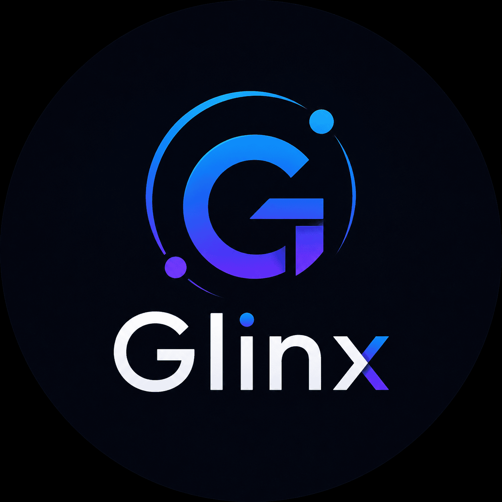

<p align="center">
  
</p>

# Glinx

**The Universal Hardware to Agent Middleware**

MCP-connected tools to LLMs. Glinx connects reality to LLMs.

## Overview

Glinx is a Python middleware framework that sits between physical hardware systems and AI agent frameworks.

Modern agent stacks are already strong on the software side. Tools, memory, orchestration, and model APIs are standardized enough that building software-only agents is straightforward. The moment real hardware enters the loop, that simplicity disappears. Cameras, IMUs, BLE devices, serial devices, MQTT brokers, CAN bus systems, microphones, and robotic actuators all expose different protocols, different data formats, and different timing models.

Glinx solves that integration gap.

It ingests hardware data from multiple protocols, normalizes and enriches that data, generates agent-friendly schemas, filters noisy sensor streams into meaningful events, and exposes the result through an MCP-compatible interface or other agent bridges.

In short: wire hardware once, then let agents reason over structured, semantic, reusable tools instead of custom glue code.

## The Problem

Physical systems do not speak the language agents want.

- A camera emits image frames.
- An IMU emits high-frequency numeric readings.
- A force sensor may publish compact fields like `p` and `t`.
- A BLE device may send notifications.
- A robot controller may publish over CAN bus or ROS2 topics.

Agents, on the other hand, want:

- stable interfaces
- clean schemas
- meaningful descriptions
- event-driven updates
- abstractions with context instead of raw payloads

Without a middleware layer, every team ends up writing custom adapters for every sensor and every project. That work is repetitive, fragile, and difficult to reuse.

## What Glinx Does

Glinx provides a common runtime that:

- ingests messages from hardware sources
- normalizes payloads into a shared internal format
- infers structured schemas from observed data
- maps raw fields into semantic, human-readable meanings
- detects meaningful conditions and anomalies
- exposes sensor state and event streams to AI agents

This makes hardware usable in the same way MCP made software tools usable for LLMs.

## Core Ideas

### Hardware Agnostic

Glinx does not care whether data comes from `MQTT`, `Serial`, `WebSocket`, `BLE`, `CAN`, `ROS2`, or another transport. Drivers adapt protocols into a shared internal message model.

### Agent Agnostic

Glinx does not force one agent framework. It is designed to support `MCP`, `LangGraph`, `LangChain`, and custom agent runtimes through bridge layers.

### Semantic First

Raw data like:

```json
{ "p": 58.4, "temp": 31.5 }
```

becomes enriched state like:

```json
{
  "sensor": "left_fingertip",
  "sensor_type": "force_sensor",
  "location": "robot.hand.left.fingertip",
  "contact_pressure_kPa": 58.4,
  "surface_temperature_kPa": 31.5,
  "semantic_summary": "left_fingertip at robot.hand.left.fingertip: contact_pressure=58.4, surface_temperature=31.5"
}
```

The agent receives the meaning of the sensor reading, not just the bytes.

### Event Driven Intelligence

Agents should not react to every tick from a 30 Hz or 100 Hz sensor stream. Glinx converts continuous streams into meaningful events such as:

- threshold breaches
- anomalies
- periodic summaries
- priority-tagged interrupts

## Architecture

```text
PHYSICAL WORLD
Camera | IMU | Touch | LiDAR | Mic | BLE | CAN | USB | MQTT
        |
        v
GLINX INGESTION LAYER
Protocol drivers normalize incoming data into GlinxMessage objects
        |
        v
GLINX SCHEMA + SEMANTIC LAYER
Schema inference + semantic enrichment + sensor meaning
        |
        v
GLINX EVENT FILTER LAYER
Rule engine + anomaly detection + summary windows
        |
        v
GLINX AGENT BRIDGE
MCP tools + future LangGraph/LangChain/custom bridges
        |
        v
AI AGENT
```

## Current MVP Features

- Config-driven runtime setup via `glinx.example.yaml`
- Pluggable driver registry
- Working `mock` driver for local demos and tests
- Shared `GlinxMessage` and `EventMessage` models
- Automatic schema inference from observed payloads
- Semantic field mapping from YAML sensor definitions
- Rule-based event triggers using safe expression evaluation
- Lightweight rolling anomaly detection using z-score logic
- Summary window generation for periodic context
- MCP bridge scaffold that exposes generated tool definitions
- CLI for config inspection and tool generation

## Current Project Layout

```text
src/glinx/
  bridges/       MCP bridge and future agent bridges
  drivers/       protocol drivers
  bus.py         internal async pub/sub bus
  cli.py         CLI entrypoint
  config.py      YAML configuration models
  events.py      rule, anomaly, and summary filtering
  models.py      core message, event, and snapshot models
  runtime.py     orchestration layer
  schema.py      schema inference engine
  semantic.py    semantic enrichment logic
tests/
  test_runtime.py
glinx.example.yaml
```

## Quick Start

### 1. Install Development Dependencies

```bash
uv sync --extra dev
```

### 2. Inspect the Example Configuration

```bash
uv run glinx inspect-config --config glinx.example.yaml
```

### 3. Generate Auto-Inferred Tool Specs

```bash
uv run glinx print-tools --config glinx.example.yaml
```

### 4. Run Tests

```bash
uv run pytest
```

### 5. Start MCP Mode

```bash
uv sync --extra mcp
uv run glinx start --config glinx.example.yaml --serve-mcp
```

## Example Configuration

The included `glinx.example.yaml` demonstrates:

- a mock IMU source
- a mock left fingertip force sensor
- semantic field remapping
- rule-based event detection
- summary window generation

Example snippet:

```yaml
ingestion:
  sources:
    - id: left_fingertip
      protocol: mock
      payloads:
        - p: 23.4
          temp: 31.1

sensors:
  - id: left_fingertip
    type: force_sensor
    location: robot.hand.left.fingertip
    unit: kPa
    fields:
      p: contact_pressure
      temp: surface_temperature

event_rules:
  - sensor: left_fingertip
    condition: contact_pressure_kPa > 50
    priority: HIGH
    label: grip_overload
```

## CLI Commands

### `glinx inspect-config`

Loads a config file and prints the detected runtime shape, including sources and sensors.

```bash
uv run glinx inspect-config --config glinx.example.yaml
```

### `glinx print-tools`

Runs one ingestion cycle and prints the generated tool definitions for the configured sources.

```bash
uv run glinx print-tools --config glinx.example.yaml
```

### `glinx start`

Initializes the runtime and optionally exposes an MCP server.

```bash
uv run glinx start --config glinx.example.yaml --serve-mcp
```

## Example Output

Generated tools look like this:

```json
[
  {
    "name": "get_left_fingertip_status",
    "description": "Returns the current semantic state for hardware source 'left_fingertip'."
  },
  {
    "name": "drain_glinx_events",
    "description": "Returns queued hardware events with semantic descriptions."
  }
]
```

## Intended Use Cases

- Robotics systems that need to expose sensors and actuators to LLM agents
- IoT environments where physical events should trigger agent actions
- Hackathon prototypes that need hardware plus AI integration quickly
- Research platforms for embodied AI and hardware-to-agent grounding
- Startups building agent-native interfaces for real-world devices

## What Is Implemented Today

The current version is an MVP scaffold focused on architecture and developer workflow.

Implemented now:

- package structure
- runtime pipeline
- config models
- mock ingestion
- semantic enrichment
- event filtering
- MCP bridge scaffold
- tests

Not implemented yet:

- real `MQTT` driver
- real `Serial` driver
- real `WebSocket` driver
- `BLE`, `CAN`, `ROS2`, `gRPC`, and camera ingestion
- modality handlers for vision and audio
- LangGraph and LangChain bridge implementations
- production-grade MCP event push integration

## Roadmap

### v0.1

- MQTT ingestion driver
- Serial ingestion driver
- WebSocket ingestion driver
- improved schema inference
- stronger MCP server integration

### v0.2

- BLE driver
- CAN bus driver
- threshold rule improvements
- summary aggregation improvements
- camera modality hook

### v0.3

- ROS2 topic bridge
- audio modality hook
- additional anomaly detectors
- basic observability and dashboarding

### v1.0

- richer ontology support
- auto-discovery for known sensor types
- distributed multi-node runtime support
- edge deployment profiles
- latency and quality benchmarking

## Development

Install dependencies and run tests:

```bash
uv sync --extra dev
uv run pytest
```

The current codebase is intentionally modular so real protocol drivers and agent bridges can be added without changing the core runtime model.

## License

MIT
